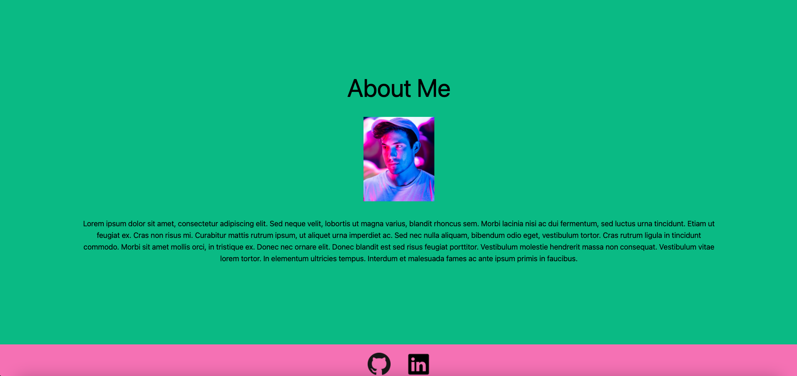

# My Portfolio
## Table of Contents
* [Description](#description)
* [Installation](#installation)
* [Usage](#usage)
* [License](#license)
* [Contributors](#contributors)
* [Links](#links)
* [Screenshots](#screenshots)
* [Questions](#questions)

## Description:
This portfolio is made with react and is using tailwindcss for the styles

## Installation:
1. Clone from Github repository.  
3. Install required npm packages:  
* react.js  
* tailwindcss  

## Usage:
Through Local Server: 
1. Start from the terminal using npm start.  
2. Go to localhost:3000  

## License:
This Repository is covered under the following license: [ISC]

## Contributors:
Richard Flores

## Links:
Deployed Application: https://richardflores009.github.io/my-portfolio/  
Github Repository: https://github.com/Richardflores009/my-portfolio  

## Screenshots:

## Questions:
Contact me: 
Github: [https://github.com/Richardflores009](https://github.com/Richardflores009) 
Email: [richardflores009@gmail.com](richardflores009@gmail.com) 
